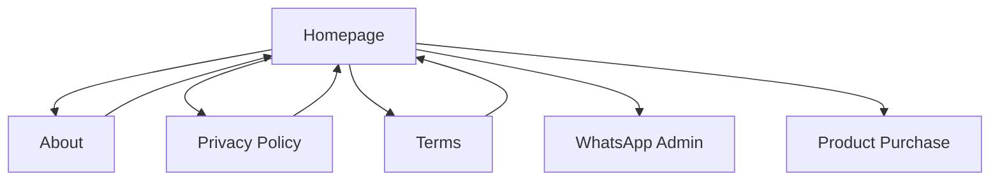

## 1. Product Overview
Migrasi website landing page Dosbing.ai dari HTML statis ke aplikasi React modern untuk meningkatkan performa, maintainability, dan user experience. Proyek ini mengubah 4 halaman utama menjadi aplikasi React dengan routing client-side, komponen reusable, dan integrasi animasi yang lebih baik.

## 2. Core Features

### 2.1 User Roles
Tidak diperlukan - website ini merupakan landing page publik tanpa autentikasi user.

### 2.2 Feature Module
Website ini terdiri dari 4 halaman utama:
1. **Homepage**: Hero section, produk, cara kerja, FAQ, kontak
2. **About**: Tentang perusahaan, visi misi, testimonial
3. **Privacy Policy**: Kebijakan privasi perusahaan
4. **Terms**: Syarat dan ketentuan layanan

### 2.3 Page Details
| Page Name | Module Name | Feature description |
|-----------|-------------|---------------------|
| Homepage | Hero Section | Banner utama dengan animasi typing effect, CTA buttons, dan background gradient |
| Homepage | Navigation | Sticky navbar dengan glassmorphism effect, mobile menu toggle |
| Homepage | Audio Player | Floating audio player dengan kontrol play/pause dan theme song |
| Homepage | Floating Contact | WhatsApp floating button dengan animasi pulse |
| Homepage | Running Text | Marquee announcement bar dengan promo information |
| Homepage | Stats Counter | Counter animasi untuk statistics perusahaan |
| Homepage | Product Showcase | Card produk dengan pricing dan tombol pembelian |
| Homepage | How It Works | Tab section untuk tutorial penggunaan produk |
| Homepage | FAQ | Accordion FAQ dengan collapse/expand functionality |
| Homepage | Contact | Google Maps embed dan kontak informasi |
| Homepage | Footer | Footer dengan links dan social media |
| About | Hero Section | Hero banner dengan tagline perusahaan |
| About | Problem Solution | Section menjelaskan masalah dan solusi |
| About | Core Values | 3 pilar utama perusahaan dalam card layout |
| About | Vision | Visi perusahaan dengan quote section |
| About | Testimonials | Card testimonial dari pengguna |
| About | CTA | Call-to-action banner |
| Privacy | Content | Legal content dalam card layout |
| Terms | Content | Legal terms dalam card layout |

## 3. Core Process
User dapat menavigasi antar halaman melalui navbar. Setiap halaman memiliki animasi scroll (AOS) dan interactive elements. User dapat membeli produk melalui tombol CTA yang mengarah ke WhatsApp admin.

## 4. User Interface Design

### 4.1 Design Style
- **Primary Color**: #1A4AB6 (Deep Trust Blue)
- **Secondary Color**: #1CB8A3 (Academic Teal)
- **Accent Color**: #F97316 (Action Orange)
- **Typography**: Montserrat (heading), Poppins (body)
- **Button Style**: Rounded corners, gradient backgrounds, hover effects
- **Layout**: Card-based design dengan shadow dan border radius
- **Animation**: AOS (Animate On Scroll), floating animations, pulse effects

### 4.2 Page Design Overview
| Page Name | Module Name | UI Elements |
|-----------|-------------|-------------|
| Homepage | Hero | Gradient background, typing animation, floating elements, CTA buttons |
| Homepage | Navbar | Glassmorphism, sticky positioning, hamburger menu for mobile |
| Homepage | Audio Player | Circular button with spinning animation, tooltip on hover |
| Homepage | Products | Card layout with pricing, badges, hover effects |
| Homepage | FAQ | Accordion with chevron rotation, smooth transitions |
| About | Values | Icon cards with gradient backgrounds, hover scale effects |
| Privacy/Terms | Content | White card container, proper typography hierarchy |

### 4.3 Responsiveness
- Desktop-first approach dengan breakpoint mobile
- Mobile menu hamburger untuk layar kecil
- Responsive grid layouts untuk semua section
- Touch-friendly buttons dan interactive elements

### 4.4 Interactive Elements
- Audio player dengan state management
- Mobile menu dengan smooth transitions
- FAQ accordion dengan collapse animation
- Tab switching untuk How It Works section
- Floating buttons dengan hover effects
- Form inputs dengan proper styling