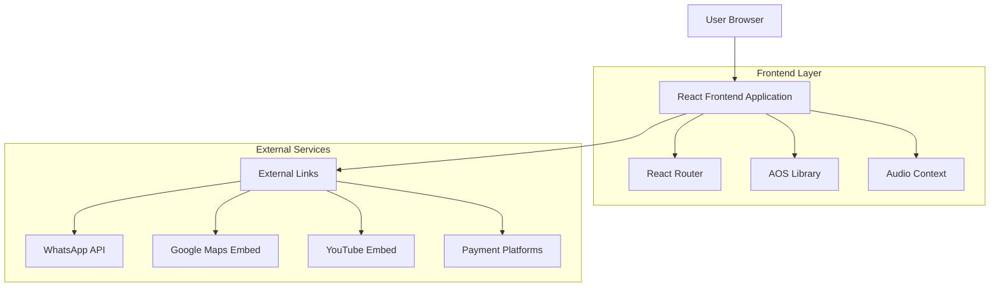

## 1. Architecture Design



## 2. Technology Description

- **Frontend**: React@18 + Vite + Tailwind CSS@3
- **Initialization Tool**: vite-init
- **Routing**: React Router DOM@6
- **Animation**: AOS (Animate On Scroll)@2.3.1
- **Icons**: Font Awesome + Heroicons
- **Backend**: None (static site)
- **Database**: None (static content)

## 3. Route Definitions

| Route | Purpose |
|-------|---------|
| / | Homepage utama dengan semua section |
| /about | Halaman tentang perusahaan dan visi misi |
| /privacy | Halaman kebijakan privasi |
| /terms | Halaman syarat dan ketentuan |

## 4. Component Structure

### 4.1 Layout Components
- `Layout.jsx` - Main layout wrapper
- `Navbar.jsx` - Navigation component dengan mobile menu
- `Footer.jsx` - Footer component
- `FloatingContact.jsx` - WhatsApp floating button
- `AudioPlayer.jsx` - Audio player component

### 4.2 Page Components
- `HomePage.jsx` - Homepage dengan semua section
- `AboutPage.jsx` - About page
- `PrivacyPage.jsx` - Privacy policy page
- `TermsPage.jsx` - Terms and conditions page

### 4.3 Reusable Components
- `HeroSection.jsx` - Hero banner component
- `ProductCard.jsx` - Product showcase card
- `FAQItem.jsx` - FAQ accordion item
- `FeatureCard.jsx` - Feature showcase card
- `CTAButton.jsx` - Call-to-action button

## 5. State Management

### 5.1 Local State (useState)
- Mobile menu toggle state
- Audio player play/pause state
- FAQ accordion active state
- Tab switching state untuk How It Works

### 5.2 Effects (useEffect)
- AOS initialization
- Audio context setup
- Typing animation untuk hero text
- Scroll event listeners untuk navbar

## 6. Asset Management

### 6.1 Static Assets
- Logo dan favicon di `public/`
- Audio file theme-song.mp3
- PDF preview template-preview.pdf
- Gambar produk dan ilustrasi

### 6.2 External Dependencies
- Google Fonts (Montserrat, Poppins)
- Font Awesome CDN
- AOS CSS dan JS dari CDN
- Google Maps embed
- YouTube embed untuk video tutorial

## 7. Build Configuration

### 7.1 Vite Configuration
```javascript
// vite.config.js
export default {
  plugins: [react()],
  build: {
    outDir: 'dist',
    assetsDir: 'assets',
    sourcemap: true
  }
}
```

### 7.2 Tailwind Configuration
```javascript
// tailwind.config.js
module.exports = {
  content: [
    "./index.html",
    "./src/**/*.{js,ts,jsx,tsx}",
  ],
  theme: {
    extend: {
      colors: {
        primary: '#1A4AB6',
        secondary: '#1CB8A3',
        accent: '#F97316',
        dark: '#0F172A',
        light: '#F8FAFC'
      },
      fontFamily: {
        sans: ['Poppins', 'sans-serif'],
        heading: ['Montserrat', 'sans-serif']
      }
    }
  }
}
```

## 8. Performance Optimization

### 8.1 Code Splitting
- Lazy loading untuk halaman About, Privacy, dan Terms
- Dynamic imports untuk komponen besar

### 8.2 Asset Optimization
- Image optimization untuk assets
- Font preloading untuk Google Fonts
- CSS minification via Vite

### 8.3 Animation Performance
- GPU-accelerated animations
- Intersection Observer untuk scroll animations
- Debounced scroll events

## 9. Mobile Optimization

### 9.1 Responsive Design
- Mobile-first approach
- Touch-friendly interactive elements
- Proper viewport meta tag
- iOS Safari specific fixes

### 9.2 Performance Mobile
- Reduced animation complexity di mobile
- Optimized touch targets
- Proper image sizing

## 10. Deployment Strategy

### 10.1 Build Process
```bash
npm run build    # Production build
npm run preview  # Preview production build
npm run dev      # Development server
```

### 10.2 Static Hosting
- Deploy ke static hosting (Netlify, Vercel, GitHub Pages)
- Proper 404 handling untuk SPA routing
- Asset caching strategies